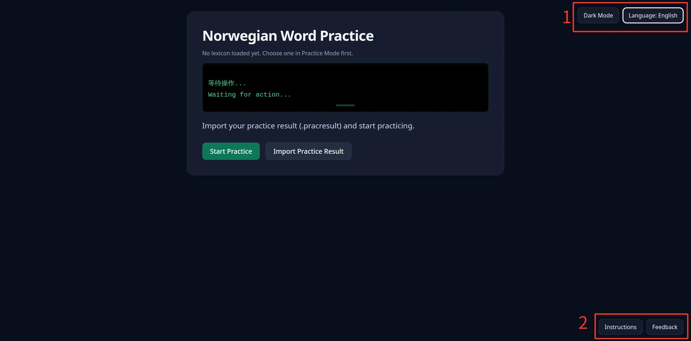

# Instructions

## Welcome

Welcome to Norwegian Word Practice. This app helps learners of Norwegian practice Norwegian spelling. I am the author, Huzz, and this is a sub-project under my personal art series *Once and Once Again*. Feel free to use the Feedback button in the bottom-right corner to join the Discord channel and discuss the software or the art with me.

## Site Overview

The site is basically divided into three parts: lexicon selection, lexicon practice, and practice summary.

* Lexicon selection:
  * I provide two kinds of lexicons: a general Norwegian word bank, and language-series banks (currently including numbers, months, pronouns, and interrogatives).
  * For the general Norwegian word bank, personal customization is supported in paid mode. Full lexicon editing is available so you can build a private word bank of your own.
  * If you choose the general Norwegian word bank, you will then enter the lexicon selection screen. You can search for words by criteria (such as Chinese/English translations, part of speech, and tags) and practice in a focused way.
* Lexicon practice:
  * You can practice specific Norwegian inflection forms according to your needs.
* Practice summary:
  * After practice, you will see accuracy for this session and across sessions, helping you track your progress. The page also shows mistakes from this session so you can review and understand your weak points.

### 1 Mode Selection

In the top-right corner, you can switch the screen brightness theme and the language.

### 2 Page Features

Every page has its own instructions in the bottom-right corner, so you can learn what that page does.

If you have questions, use the Feedback button to jump to the Discord channel and report issues or share suggestions.
