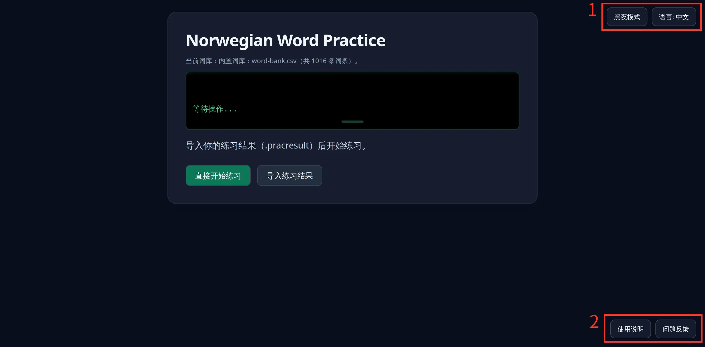

# 使用说明

## 欢迎

欢迎使用Norwegian Word Practice。这个软件主要帮助挪威语的学习者练习挪威语的拼写。我是作者Huzz,这是我的个人艺术创作Once and Once Again系列下的一个子项目。欢迎通过右下角的问题反馈按钮进入discord频道和我针对软件和艺术进行讨论。

## 网站简介

网站基本分为三个部分：选择词库部分，词库练习部分和练习总结部分

* 选择词库部分：
  * 我提供两种词库，一种是整体意义上的挪威语词库，另一种是语言系列词库（目前包括数字，月份，代词和疑问词系列）
  * 对于整体意义上的挪威语词库，在付费模式下支持个人定制，我提供完整的词库编辑功能，可以私人定制属于自己的词库
  * 如果选择整体意义上的挪威语词库的话，之后会练习词库选择界面。你可以根据条件（比如中英文翻译，词性，标签）搜索自己想要练习的单词，有针对性地练习。
* 词库练习部分：
  * 可以根据自己的需要练习特定几种挪威语的变形
* 练习总结部分：
  * 在练习后会显示本次练习和历次练习的准确率，帮助了解自己的进步状况。页面中也会显示本次练习的单词错误，方便复习和了解自己的缺陷。

### 1 模式选择

在右上角的模式选择中可以切换屏幕亮度主题和语言模式

### 2 页面功能

在每页的右下角都有不同的使用说明，方便了解页面的功能

如果有问题，可以通过问题反馈按钮跳转到discord频道中反馈问题，或者提供建议
