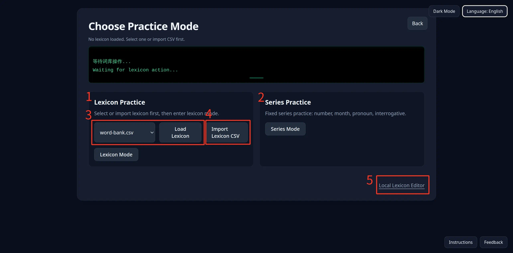

# Instructions

## Choose Practice Mode

Use this page to pick which practice path to enter next, and to load or import a dictionary when needed. The top of the page shows the current lexicon status; the mini console in the middle reports results of load and import actions.

### 1 Lexicon Practice

For practicing with the general Norwegian word bank. Workflow: load or import a dictionary first, then click **Lexicon Mode** to enter lexicon selection and practice.

* After entering, you can filter words by translation, part of speech, tags, and more, then practice Norwegian spelling and inflection forms.

### 2 Series Practice

For fixed series practice. Currently includes numbers, months, pronouns, interrogatives, and similar sets.

* These exercises use built-in series content and generally do not depend on the general lexicon loaded on this page.
* Click **Series Mode**, then choose a specific series to start practicing.

### 3 Listen / Read along

Opens the audio player. It matches audio with lyrics by filename so you can read along.

* Click **Open player** to enter the player page.
* Load the built-in book (Byen Er Bergen) or open a local folder of audio and `.lrc` / `.srt` files.

### 4 Load Built-in Lexicon

Choose a built-in encrypted lexicon from the dropdown (for example `word-bank.nwpdict`), then click **Load Lexicon**.

* A successful load overwrites the current lexicon, and the entry count appears in the status line above and in the console.
* If no lexicon is loaded yet, complete this step first, or use the import option below instead.

### 5 Import Dictionary File

Click **Import Dictionary File** and select a dictionary file from your computer.

* Only encrypted `.nwpdict` is supported (plain `.csv` is not accepted)
* Import also overwrites the current lexicon. This is useful for word lists you exported or edited yourself.
* Results appear in the mini console in the middle of the page.

### 6 Local Lexicon Editor

The **Local Lexicon Editor** link at the bottom right opens the lexicon editor page.

* You must connect a wallet that holds an NFT from this collection; otherwise the app will prompt you to connect, or open the mint page in a new tab
* On the editor page you can customize a private lexicon and export encrypted lexicon files (`.nwpdict`) from the lexicon browser; import is still done on this page
* Exported files can be loaded here with **Import Dictionary File** before practicing

Use **Back** at the top of the page to return to the home page.
