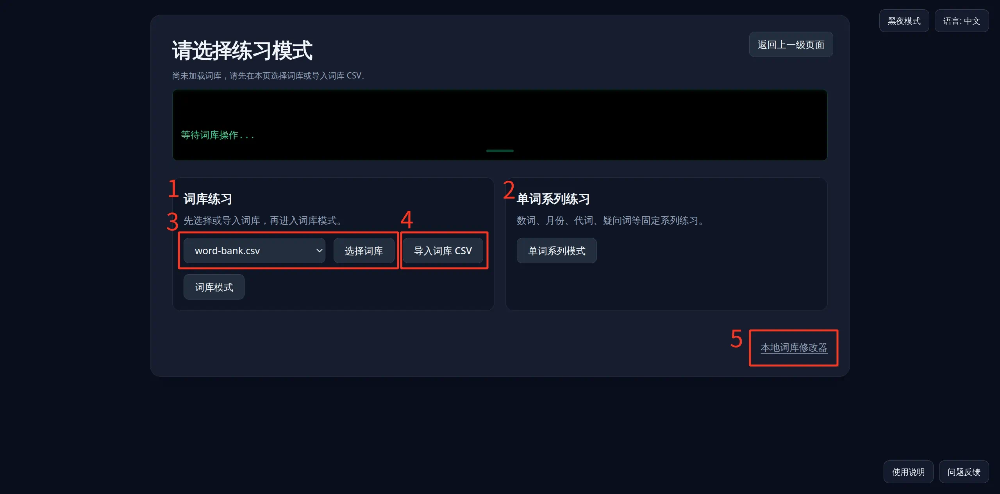

# 使用说明

## 练习模式选择

本页用于选择接下来要进入的练习路径，并在需要时先加载或导入词库。页面上方会显示当前词库状态；中间的小控制台会反馈加载、导入等操作结果。

### 1 词库练习

用于练习整体意义上的挪威语词库。流程是：先加载或导入词库，再点击「词库模式」进入词库选择与练习。

* 进入后可以按翻译、词性、标签等条件筛选单词，再开始练习挪威语拼写与变形。

### 2 单词系列练习

用于固定系列练习，目前包括数词、月份、代词、疑问词等。

* 这类练习使用内置系列内容，一般不依赖本页加载的通用词库。
* 点击「单词系列模式」后，再选择具体系列即可开始练习。

### 3 选择内置词库

在下拉框中选择内置 CSV（例如 `word-bank.csv`），再点击「选择词库」加载。

* 加载成功后会覆盖当前词库，并在上方状态行与控制台中显示词条数量。
* 若尚未加载任何词库，请先完成这一步，或改用下方的导入功能。

### 4 导入词库 CSV

点击「导入词库 CSV」，从本机选择符合格式的词库文件。

* 导入同样会覆盖当前词库，适合使用自己导出或编辑过的词表。
* 操作结果会显示在中间的控制台中。

### 5 本地词库修改器

页面右下角的「本地词库修改器」可进入词库编辑页。

* 需要先连接钱包，并且持有本系列 NFT；否则会引导连接钱包，或在新标签页打开铸造页
* 编辑页可私人定制词库，并在词库浏览器中导出 CSV；导入 CSV 仍在本页完成
* 导出的文件可回到本页用「导入词库 CSV」载入后再练习

左上角「返回上一级页面」可回到首页。
